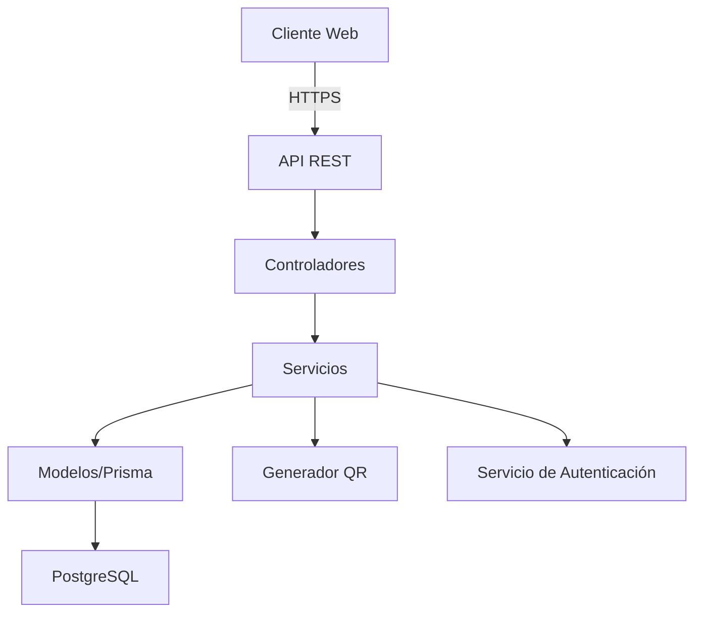

# Arquitectura del Sistema

## 1. Diagrama de Arquitectura

## 2. Componentes Principales

### 2.1 Frontend (SvelteKit)
- **Páginas**: 
  - Autenticación (login/registro)
  - Dashboard
  - Gestión de Equipos
  - Generación de QR
- **Componentes**:
  - Formularios
  - Tablas de datos
  - Visualizador de QR
  - Barra de navegación

### 2.2 Backend (Node.js + SvelteKit API Routes)
- **Autenticación**:
  - JWT para autenticación
  - Middleware de autorización
  - Gestión de sesiones

- **Módulos Principales**:
  - Usuarios
  - Equipos
  - Generación de QR
  - Reportes

### 2.3 Base de Datos (PostgreSQL)
- **Tablas**:
  - `usuario`: Datos de usuarios
  - `equipos`: Registro de equipos
  - (Otras tablas según sea necesario)

## 3. Flujo de Datos

1. **Autenticación**:
   - Cliente envía credenciales
   - Servidor valida y devuelve JWT
   - Cliente almacena token para futuras peticiones

2. **Gestión de Equipos**:
   - Cliente envía datos del formulario
   - Servidor valida y procesa los datos
   - Se genera código QR si es necesario
   - Datos almacenados en base de datos

3. **Generación de QR**:
   - Cliente solicita generación de QR
   - Servidor genera o recupera código existente
   - Se devuelve la imagen del código QR

## 4. Seguridad

- **Autenticación**: JWT con expiración
- **Autorización**: Roles de usuario
- **Validación de Entrada**: En todos los endpoints
- **Protección CSRF**: Implementada
- **CORS**: Configuración estricta

## 5. Despliegue

- **Contenedores**: Docker
- **Orquestación**: Docker Compose
- **Base de datos**: PostgreSQL en contenedor
- **Variables de entorno**: Configuración sensible

## 6. Monitoreo y Logs

- Logs de aplicación
- Monitoreo de errores
- Métricas de rendimiento

## 7. Escalabilidad

- Arquitectura sin estado (stateless)
- Posibilidad de escalar horizontalmente
- Caché para consultas frecuentes